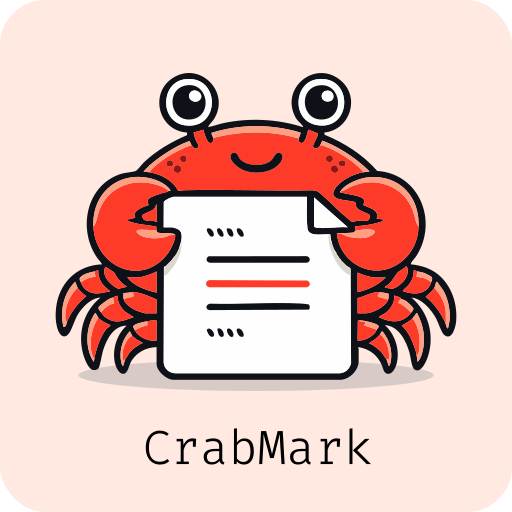

<div align="center">
  <h1>CrabMark Specification (v0.1 Draft)</h1>
  
</div>

**CrabMark** is a Markdown superset designed to standardise commonly used extensions while maintaining compatibility with CommonMark and GitHub Flavoured Markdown (GFM).

**CrabMark aims to:**

* Preserve plain-text readability
* Minimise new syntax
* Consolidate widely adopted extensions
* Provide a consistent, extensible rendering model

---

## 1. Design Principles

### 1.1 Compatibility

* All valid [CommonMark](https://commonmark.org/) is valid CrabMark
* [GFM](https://github.github.com/gfm/) features are considered baseline where applicable

### 1.2 Minimal Syntax Expansion

* Prefer existing, widely used syntax (Pandoc, MultiMarkdown, GFM)
* Avoid introducing new syntactic forms unless necessary

### 1.3 Clear Separation

* **Inline features** → lightweight text semantics
* **Block features** → fenced rendering engines

### 1.4 Extensibility

* All advanced rendering is handled via fenced blocks

---

## 2. Inline Syntax

### 2.1 Superscript

```
^text^
```

### 2.2 Subscript

```
~text~
```

### 2.3 Strikethrough

```
~~text~~
```

### 2.4 Insertion

```
{++text++}
```

### 2.5 Deletion

```
{--text--}
```

### 2.6 Highlight

```
==text==
```

### 2.7 Footnotes

Reference:

```
Text[^1]
```

Definition:

```
[^1]: Footnote content
```

### 2.8 Inline Math

```
$E = mc^2$
```

---

## 3. Block Syntax

### 3.1 Fenced Block Model

All structured or renderable content uses fenced blocks:

````markdown
```<type>
<content>
```
````

Where `<type>` defines the rendering engine.

---

### 3.2 Display Math

````markdown
```math
E = mc^2
```
````

---

### 3.3 Mermaid Diagrams

````markdown

````

---

### 3.4 Charts / Data Visualisation

````markdown
```chart
{ "type": "bar" }
```
````

---

### 3.5 Task Blocks (Optional Structured Form)

Inline tasks remain standard:

```
- [ ] Task
- [x] Done
```

Optional structured block:

````markdown
```tasks
- [ ] Task
- [x] Done
```
````

---

## 4. Lists and Tables

### 4.1 Task Lists

```
- [ ] Task
- [x] Done
```

### 4.2 Tables

Standard GFM pipe tables:

```
| Col A | Col B |
|------|------|
| 1    | 2    |
```

---

## 5. Additional Syntax

### 5.1 Abbreviations

```
*[HTML]: HyperText Markup Language
```

### 5.2 Definition Lists

```
Term

: Definition
```

### 5.3 Table of Contents

```
{{TOC}}
```

---

## 6. Metadata

YAML frontmatter is supported:

```yaml
---
title: Example Document
author: Author Name
---
```

---

## 7. Parsing Rules

### 7.1 Precedence

1. Fenced blocks are parsed first
2. Inline syntax is parsed after block structure
3. Inline math takes precedence over other inline markers within `$...$`

### 7.2 Tilde Handling

* `~~text~~` → strikethrough
* `~text~` → subscript

Rule:

* Double tilde (`~~`) has precedence over single tilde (`~`)

---

## 8. Rendering Model

### 8.1 Block Types

| Type      | Category | Description                  |
| --------- | -------- | ---------------------------- |
| `math`    | Active   | Render via LaTeX engine      |
| `mermaid` | Active   | Render diagram               |
| `chart`   | Active   | Render data visualisation    |
| `tasks`   | Active   | Render interactive checklist |
| others    | Passive  | Render as code block         |

### 8.2 Active vs Passive Blocks

* **Active blocks** require a rendering engine
* **Passive blocks** render as standard code blocks if unsupported

### 8.3 Fallback Behaviour

If a renderer does not support a block type:

* Display as a standard fenced code block
* Preserve content without modification

---

## 9. Security Considerations

* Renderers must sanitise HTML output
* External engines (e.g. Mermaid) should be sandboxed
* No arbitrary script execution is permitted

---

## 10. Extension Model (Future)

CrabMark may support extension declarations:

```yaml
---
crabmark: 0.1
extensions:
  - math
  - mermaid
  - chart
---
```

---

## 11. Goals (Non-Normative)

CrabMark aims to:

* Reduce fragmentation across Markdown flavours
* Provide a predictable authoring experience
* Enable tooling interoperability
* Support technical, academic, and documentation workflows

---

## 12. Non-Goals

CrabMark does not:

* Replace CommonMark
* Introduce complex programming logic
* Require specific rendering engines

---

## 13. Status

This is a draft specification (v0.1).
Subject to iteration and refinement.

---
